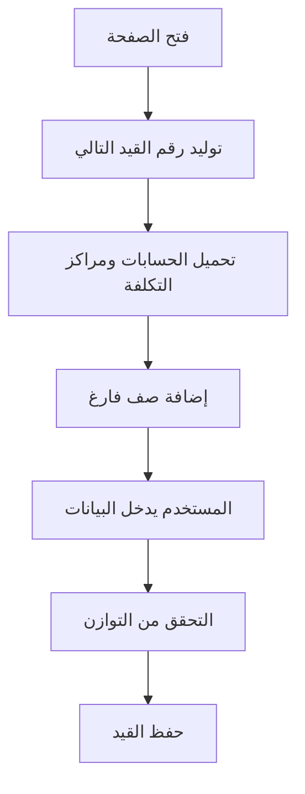

# آلية عمل قيد التسوية (Adjustment Voucher)

## نظرة عامة

قيد التسوية (Adjustment Voucher) هو نوع من أنواع القيود المحاسبية في النظام يُستخدم لتسجيل الحركات المحاسبية التي لا يمكن تصنيفها ضمن السندات القبضية أو الصرفية. يتم التعرف عليه بنوع قيد رقم `3` (vouch_type = 3).

## معمارية النظام

### 1. الملفات الرئيسية

```
app/(pages)/forms/voucher/
├── page.tsx                       # الصفحة الرئيسية لقيد التسوية
├── components/
│   ├── VoucherContainer.tsx       # الحاوية الرئيسية
│   ├── VoucherHeader.tsx          # رأس القيد
│   └── VoucherDetailsTable.tsx    # جدول التفاصيل
└── 

app/actions/
└── voucher.action.ts              # Server Actions للحفظ والتحديث

services/api/
└── voucher.service.ts             # خدمات API

types/
└── voucher.ts                     # أنواع البيانات
```

### 2. بنية قاعدة البيانات

#### جدول `vouchers` (رأس القيد)
```typescript
{
  id: number;              // المعرف الأساسي (Primary Key)
  vouch_id: number;        // رقم القيد المتسلسل للنوع
  vouch_date: string;      // تاريخ القيد
  vouch_type: number;      // نوع القيد (3 = قيد تسوية)
  vouch_amt: number;       // إجمالي مبلغ القيد
  vouch_notes?: string;    // البيان
  vouch_status?: number;   // حالة القيد
  pay_type: number;        // طريقة الدفع
  ref_no?: string;         // رقم المرجع
  cr_date: string;         // تاريخ الإنشاء
  com: number;             // رقم الفرع (ثابت = 1)
  year: number;            // السنة المحاسبية (ثابت = 1)
}
```

#### مثال على بيانات `vouchers_list`:
```json
{
  "id": 10,
  "vouch_id": 1,
  "vouch_date": "2025-09-10T18:20:31.923000Z",
  "vouch_type": 1,
  "pay_type": 1,
  "mobile": null,
  "vat_no": null,
  "Address": null,
  "bag_wt": null,
  "vouch_amt": "0.00000",
  "ref_no": "1234",
  "vouch_notes": "قيد تسويه",
  "vouch_status": 1,
  "post": false,
  "commit": false,
  "print": false,
  "opps_vouch": true,
  "attachments": null,
  "cr_date": "2025-09-10T18:28:31.687321Z",
  "cr_user": "",
  "upd_date": null,
  "upd_user": null,
  "com": 1,
  "year": 1,
  "cust": null,
  "inv_id": null,
  "acc": null,
  "cur": null
}
```

#### جدول `vouchers_dtl` (تفاصيل القيد)
```typescript
{
  id: number;              // المعرف الأساسي
  vouch: number;           // ربط برأس القيد (FK إلى vouchers.id)
  acc: number;             // رقم الحساب
  debit: number;           // المدين (نقدي)
  credit: number;          // الدائن (نقدي)
  debit_g: number;         // المدين (ذهب)
  credit_g: number;        // الدائن (ذهب)
  gauge: number;           // المعايرة (جرام)
  cost_id?: number;        // مركز التكلفة
  tax: number;             // الضريبة
  tax_prc: number;         // نسبة الضريبة
  vat_no: number;          // الرقم الضريبي
  vouch_notes?: string;    // البيان
  com: number;             // رقم الفرع
  year: number;            // السنة المحاسبية
}
```

#### العلاقة بين الجدولين:
- **`vouchers.id`** ← **`vouchers_dtl.vouch`**
- حقل `vouch` في جدول التفاصيل مرتبط مع `id` في جدول الرأس
- هذا هو الرابط الأساسي بين رأس القيد وتفاصيله

#### المعاملات المطلوبة (Parameters):

##### لجلب `vouchers_list` (رأس القيود):
```typescript
{
  id: number;        // معرف القيد من جدول vouchers
  com: number;       // رقم الفرع (ثابت = 1)
  year: number;      // السنة المحاسبية (مطلوب)
}
```

##### لجلب `vouchers_dtl_list` (تفاصيل القيد):
```typescript
{
  id: number;        // معرف القيد من جدول vouchers
  com: number;       // رقم الفرع (ثابت = 1)
  // لا يحتاج year
}
```

#### مثال على استدعاء API:
```typescript
// جلب قائمة القيود
const vouchers = await voucherService.getAll({
  id: voucherId,      // معرف القيد
  com: 1,            // رقم الفرع
  year: 1            // السنة المحاسبية
});

// جلب تفاصيل قيد محدد
const details = await voucherService.getDetails(vouchId, {
  id: voucherId,      // معرف القيد
  com: 1             // رقم الفرع فقط
});
```

## آلية العمل الصحيحة

### 1. فهم العلاقة بين الجدولين:
- **جدول `vouchers`**: يحتوي على رأس القيد مع `id` كمعرف أساسي
- **جدول `vouchers_dtl`**: يحتوي على تفاصيل القيد مع `vouch` كمعرف خارجي
- **الربط**: `vouchers.id` = `vouchers_dtl.vouch`

### 2. المعاملات المطلوبة للـ API:

#### لجلب `vouchers_list`:
```typescript
const params = {
  id: voucherId,      // معرف القيد من جدول vouchers
  com: 1,            // رقم الفرع (مطلوب)
  year: 1            // السنة المحاسبية (مطلوب)
};
```

#### لجلب `vouchers_dtl_list`:
```typescript
const params = {
  id: voucherId,      // معرف القيد من جدول vouchers
  com: 1             // رقم الفرع (مطلوب فقط)
  // لا يحتاج year
};
```

### 3. مثال عملي:
```typescript
// إذا كان لديك قيد برقم id = 10 في جدول vouchers
const voucherId = 10;

// لجلب قائمة القيود:
const vouchers = await voucherService.getAll({
  id: 10,           // معرف القيد
  com: 1,           // رقم الفرع
  year: 1           // السنة المحاسبية
});

// لجلب تفاصيل القيد:
const details = await voucherService.getDetails(voucherId, {
  id: 10,           // معرف القيد
  com: 1            // رقم الفرع فقط
});
```

## سير العمل (Workflow)

### 1. إنشاء قيد تسوية جديد

#### خطوات العمل:
1. **توليد رقم القيد**: يتم استدعاء `generateNextVoucherNumber()` لتوليد رقم تسلسلي للنوع 3
2. **تحميل البيانات**: يتم تحميل الحسابات ومراكز التكلفة وأنواع القيود
3. **إضافة صفوف**: يتم إضافة صفوف فارغة في جدول التفاصيل
4. **إدخال البيانات**: المستخدم يدخل بيانات القيد

#### تدفق البيانات:



### 2. حساب التوازن (Balance)

```typescript
// حساب إجمالي المدين والدائن
const totals = details.reduce((acc, detail) => ({
  totalDebit: acc.totalDebit + (detail.debit || 0),
  totalCredit: acc.totalCredit + (detail.credit || 0),
  totalDebitG: acc.totalDebitG + (detail.debit_g || 0),
  totalCreditG: acc.totalCreditG + (detail.credit_g || 0)
}), { totalDebit: 0, totalCredit: 0, totalDebitG: 0, totalCreditG: 0 });

// حساب الفرق
const balance = totals.totalDebit - totals.totalCredit;
const isBalanced = Math.abs(balance) < 0.01; // يجب أن يكون الفرق < 0.01
```

**قاعدة التوازن**: يجب أن يكون إجمالي المدين مساوي لإجمالي الدائن في الحالة المثالية، أو الفرق أقل من 0.01.

### 3. حفظ القيد

#### السير خلف الخدمات (Server Actions)

```typescript
// app/actions/voucher.action.ts

async function createVoucherAction(voucherData, details) {
  // 1. إضافة معاملات النظام
  const voucherPayload = {
    ...voucherData,
    com: 1,        // الفرع
    year: 1,       // السنة
    cr_date: new Date().toISOString()
  };

  // 2. حفظ رأس القيد
  const voucherResponse = await voucherService.create(voucherPayload);
  const masterId = voucherResponse.data.id;

  // 3. حفظ التفاصيل
  for (const detail of details) {
    const detailData = {
      vouch: masterId,     // ربط برأس القيد
      acc: detail.acc_id,  // رقم الحساب
      debit: detail.debit || 0,
      credit: detail.credit || 0,
      debit_g: detail.debit_g || 0,
      credit_g: detail.credit_g || 0,
      gauge: detail.gauge || 875,
      cost_id: detail.cost_id,
      tax: detail.tax || 0,
      tax_prc: detail.tax_prc || 0,
      vat_no: detail.vat_no || 0,
      vouch_notes: detail.vouch_notes,
      com: 1,
      year: 1
    };

    await voucherService.createDetail(detailData);
  }

  // 4. Revalidate للملفات المؤقتة
  revalidatePath("/forms/voucher");
  revalidatePath("/reports/vouchers");

  return { success: true, data: { vouch_id: masterId } };
}
```

### 4. توليد الرقم التالي

```typescript
// services/api/voucher.service.ts

async getNextNumber(voucherType: number = 3) {
  // 1. جلب جميع السندات
  const response = await this.getAll();

  // 2. فلترة حسب النوع
  const vouchers = response.data.filter(
    v => Number(v.vouch_type) === Number(voucherType) &&
         v.vouch_id && v.vouch_id > 0
  );

  // 3. إيجاد أكبر رقم
  const maxId = vouchers.reduce((max, curr) => 
    curr.vouch_id > max ? curr.vouch_id : max, 0
  );

  // 4. إرجاع الرقم التالي
  return maxId + 1;
}
```

**ملاحظات مهمة**:
- كل نوع قيد له تسلسل منفصل (vouch_type)
- النوع 3 = قيد تسوية
- النوع 1 = سند قبض
- النوع 2 = سند صرف
- النوع 0 = قيد افتتاحي

## الربط بالبيانات

### 1. ربط تفاصيل القيد برأس القيد

```
vouchers_dtl.vouch → vouchers.id
```

- حقل `vouch` في جدول التفاصيل يُشير إلى `id` (Primary Key) في جدول رأس القيد
- **لا يُستخدم** `vouch_id` للربط لأن `vouch_id` هو رقم متسلسل وليس معرف فريد

### 2. ربط الحسابات

```
vouchers_dtl.acc → accounts.id
```

- الحسابات تُحمّل من خدمة `accountService.getAllAccounts()`
- فقط المستوى 5 (acc_level = 5) من الحسابات يُستخدم

### 3. ربط مراكز التكلفة

```
vouchers_dtl.cost_id → cost_centers.id
```

- مراكز التكلفة اختيارية (nullable)

### 4. معاملات النظام الثابتة

```typescript
const SYSTEM_PARAMS = {
  com: 1,      // الشركة/الفرع
  year: 1,     // السنة المحاسبية (للكتابة)
  xcom_id: "1",
  xyear_id: "0" // 0 = جميع السنوات (للقراءة)
};
```

## حالات الاستخدام

### 1. قيد تسوية بسيط (نقدي فقط)

```
من ح/ البنك (مدين): 1000
إلى ح/ النقدية (دائن): 1000
```

### 2. قيد تسوية مع ذهب

```
من ح/ مخزون الذهب (مدين ذهب): 50 جرام
إلى ح/ صندوق الذهب (دائن ذهب): 50 جرام
```

### 3. قيد تسوية مختلط (نقدي + ذهب)

```
من ح/ البنك (مدين): 5000
إلى ح/ صندوق الذهب (دائن ذهب): 25 جرام
```

### 4. قيد تسوية مع ضريبة

```
من ح/ المصروفات (مدين): 1000 + ضريبة 150
إلى ح/ البنك (دائن): 1150
```

### 5. قيد تسوية مع مركز تكلفة

```
من ح/ رواتب (مدين): 5000، مركز: الإدارة
إلى ح/ الخزينة (دائن): 5000، مركز: الإدارة
```

## التحقق من صحة البيانات (Validation)

### في الواجهة (Client Side):

```typescript
if (!isBalanced) {
  alert("يجب أن يكون إجمالي المدين مساوي لإجمالي الدائن");
  return;
}

if (details.length === 0) {
  alert("يجب إضافة تفاصيل للقيد");
  return;
}

if (!voucher.vouch_id || voucher.vouch_id <= 0) {
  alert("رقم القيد غير صحيح");
  return;
}
```

### في السيرفر (Server Side):

```typescript
// يجب التحقق من:
// 1. وجود الحساب في النظام
// 2. صحة البيانات المالية (debit, credit)
// 3. التوازن المحاسبي
// 4. التفويضات الأمنية
```

## طباعة القيد

### تنسيق الطباعة:

```
┌─────────────────────────────────────────┐
│         قيد تسوية                       │
│  رقم القيد: 123                        │
│  التاريخ: 2024-01-15                   │
│  البيان: تسوية حساب البنك              │
├─────────────────────────────────────────┤
│ الحساب | مدين | دائن | مدين ذهب | دائن ذهب │
├─────────────────────────────────────────┤
│ ح/ البنك   | 1000 | 0   | 0   | 0       │
│ ح/ النقدية | 0    | 1000| 0   | 0       │
├─────────────────────────────────────────┤
│ الإجمالي   | 1000 | 1000| 0   | 0       │
└─────────────────────────────────────────┘
```

## الملاحظات المهمة

1. **حقل `vouch` vs `vouch_id`**:
   - `vouch_id`: رقم متسلسل يُعرض للمستخدم
   - `vouch`: معرف قاعدة البيانات (FK) يُستخدم للربط

2. **معاملات النظام الثابتة**:
   - `com = 1`: الشركة/الفرع
   - `year = 1`: السنة المحاسبية
   - لا يتم تغييرها من الواجهة

3. **المعايرة الافتراضية**:
   - `gauge = 875`: المعايرة الافتراضية للذهب

4. **التوازن المطلوب**:
   - المدين = الدائن (نقدي)
   - المدين ذهب = الدائن ذهب (ذهب)
   - الفرق المسموح < 0.01

5. **الحسابات المسموحة**:
   - فقط الحسابات من المستوى 5 (الحسابات النهائية)

## التطويرات المستقبلية

- [ ] إضافة التحقق من التفويضات
- [ ] إضافة تاريخ الصلاحية للقيود
- [ ] دعم العملات المتعددة
- [ ] ربط القيود بالفواتير
- [ ] دعم المعالجة المجمعة (Batch Processing)
- [ ] تقارير تحليلية للقيود

## المراجع

- ملف الصفحة: `app/(pages)/forms/voucher/page.tsx`
- Server Actions: `app/actions/voucher.action.ts`
- Service Layer: `services/api/voucher.service.ts`
- Type Definitions: `types/voucher.ts`
